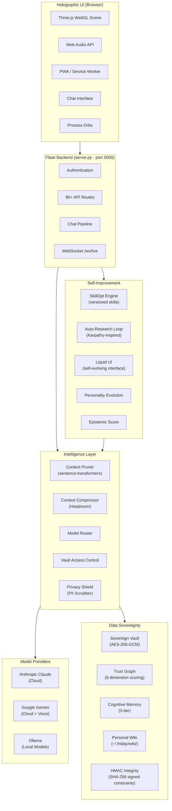
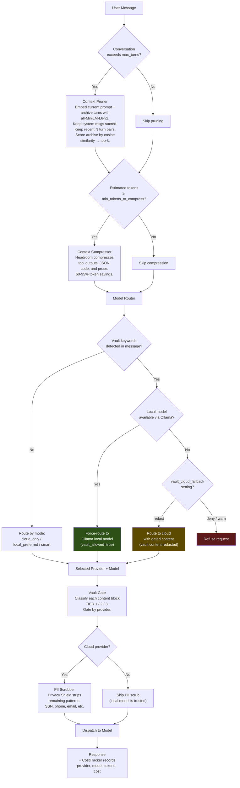
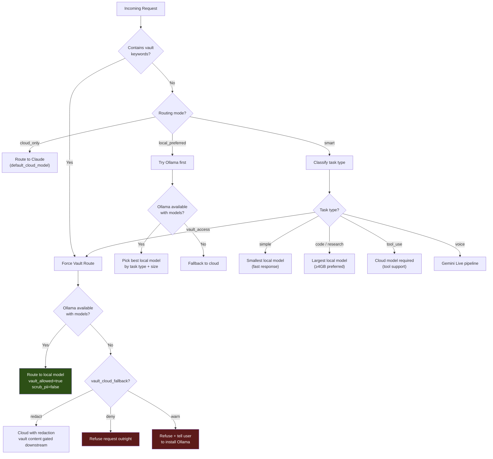
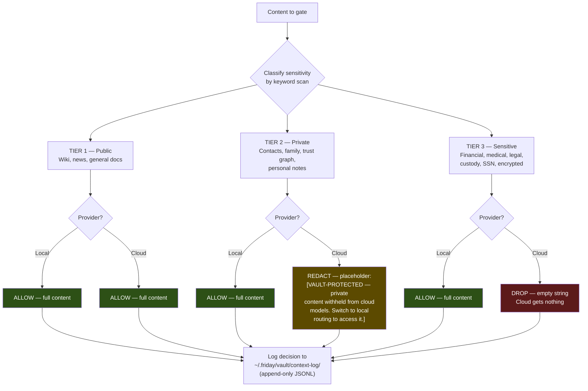
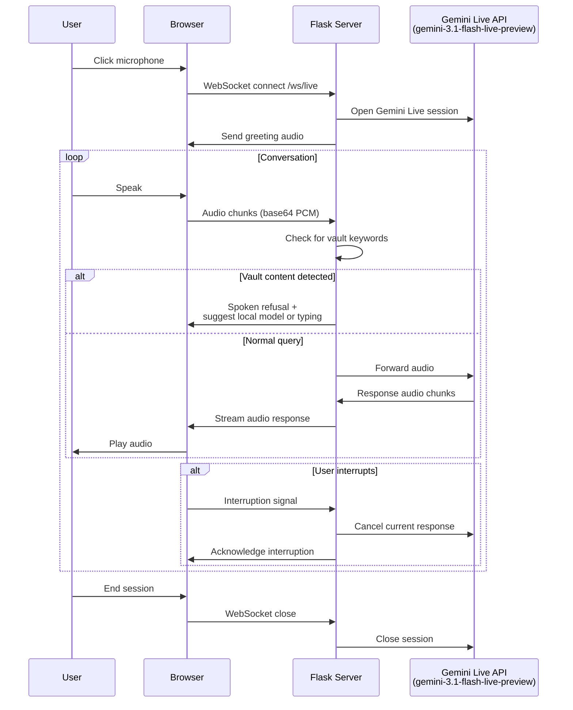
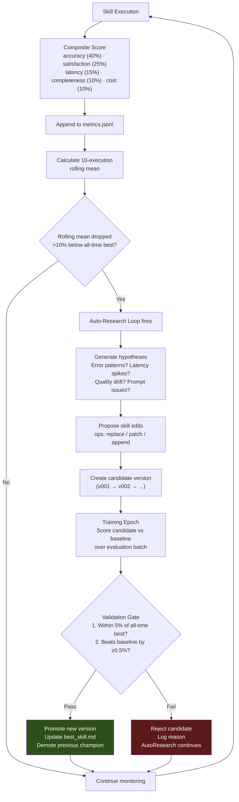
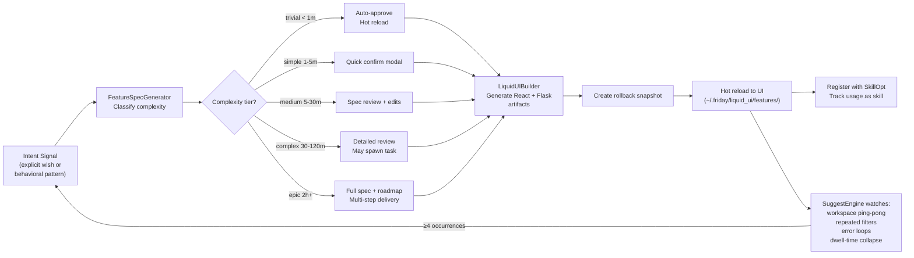
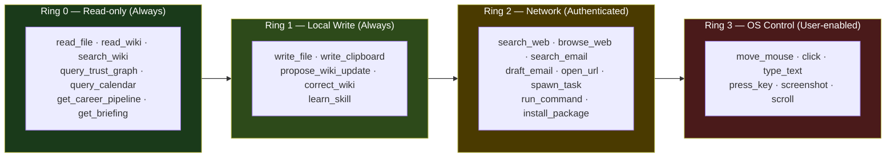

# Architecture

Agent Friday's architecture is organized around three pillars: **intelligence** (how Friday thinks), **data sovereignty** (how Friday protects), and **self-improvement** (how Friday evolves).

---

## System Overview



---

## Chat Pipeline

Every user message flows through this pipeline before reaching a model:



---

## Model Routing Decision Tree



### Task Classification

The router classifies the last user message by scanning for intent signals:

| Task Type | Detection | Preferred Route |
|-----------|-----------|-----------------|
| `simple` | Short message (<200 chars), no tools | Smallest local model |
| `code` | Keywords: write code, implement, refactor, debug, function, class, def, import, algorithm | Largest local model (≥4GB) |
| `research` | Keywords: research, analyze, compare, deep dive, explain in detail, comprehensive | Largest local model (≥4GB) |
| `tool_use` | Request includes tool definitions | Cloud (tool support required) |
| `voice` | Voice pipeline active | Gemini Live |
| `vault_access` | Vault keywords or vault tool definitions | Forced local |

---

## Vault Access Control Flow



### TIER 3 Keywords (Sensitive)
Financial, bank account, routing number, investment, portfolio, tax return, salary, income, health record, medical, medication, prescription, diagnosis, insurance, legal, custody, court, OFW, Our Family Wizard, SSN, social security, passport, driver's license, encrypted, sovereign vault.

### TIER 2 Keywords (Private)
Contact, phone number, home address, family, daughter, partner, personal note, memory, trust graph, relationship, todo, co-parenting schedule.

---

## Voice Mode Pipeline



---

## Skill Self-Improvement Loop



---

## Liquid UI Pipeline



---

## Governance: Privilege Rings



Every tool call passes through the governance gate, which:
1. Checks the privilege ring
2. Verifies the HMAC-SHA256 signature on behavioral constraints
3. Applies rate limiting (max 20 OS actions/second for Ring 3)
4. Blocks destructive operations (`rm`, `del`, `format`, `shutdown`, `reg delete`)
5. Logs the decision to `~/.friday/vault/decision-bom.jsonl`

---

## Data Storage Layout

```
~/.friday/
├── settings.json              # All configuration (API keys, routing, etc.)
├── personality.json           # Personality evolution state
├── epistemic_scores.json      # Epistemic self-calibration
├── trust_graph.json           # Relationship trust scores
├── privacy_shield.json        # PII scrubber config + watchlist
├── voice_debug.log            # Voice mode diagnostics
├── memory/                    # Long-term memory entries
├── wiki/                      # Personal wiki (by domain)
│   ├── identity/
│   ├── family/
│   ├── professional/
│   ├── health/
│   ├── legal/
│   └── finance/
├── vault/
│   ├── .governance-key        # HMAC signing key (generated on first run)
│   ├── context-log/           # Access decision audit trail (JSONL)
│   └── decision-bom.jsonl     # Governance decision log
├── skillopt/                  # Skill optimization data
│   └── <skill_name>/
│       ├── versions/          # v001.md, v002.md, ...
│       ├── metrics.jsonl      # Execution log (append-only)
│       ├── best_skill.md      # Current champion artifact
│       ├── config.json        # Weights + thresholds
│       └── research_log.jsonl # Auto-research findings
├── liquid_ui/                 # Self-evolving UI state
│   ├── requests.jsonl         # Intent log
│   ├── features/              # Feature specs + build artifacts
│   ├── snapshots/             # Rollback snapshots (60-day retention)
│   ├── usage.jsonl            # Feature usage events
│   └── suggestions.jsonl      # Proactive suggestions
├── skills/                    # Lightweight YAML skill definitions
├── audio-cache/               # TTS audio cache
└── vibe-code-logs/            # Vibe code terminal logs
```
